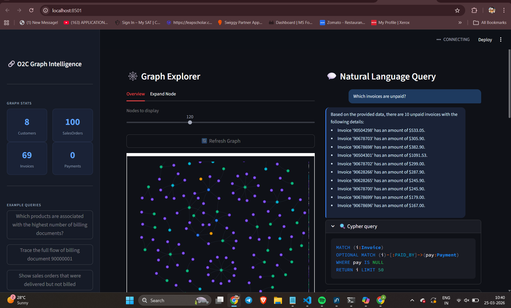
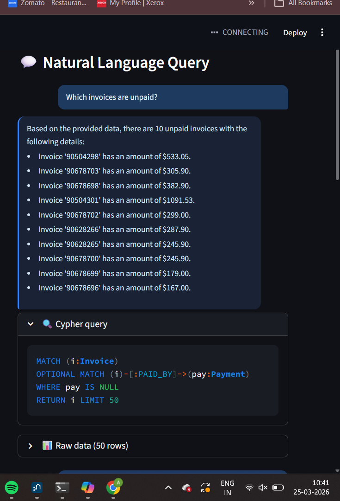
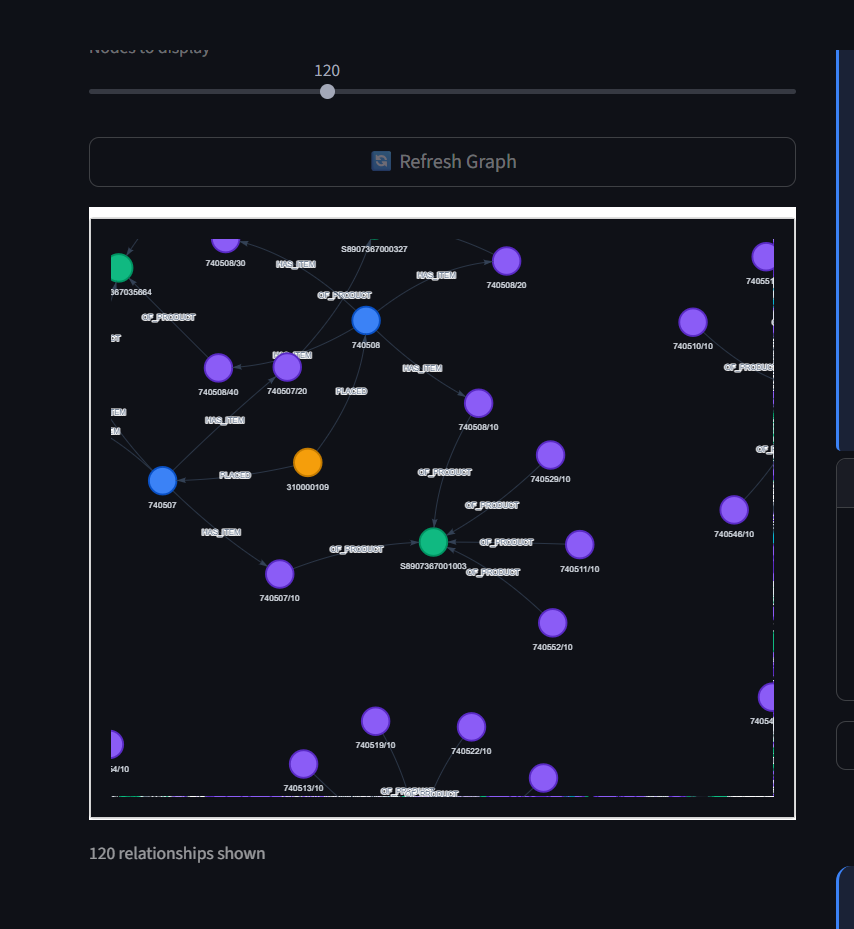

# 🚀 O2C Graph Intelligence System  
### AI-Powered Natural Language Querying over Neo4j (SAP Order-to-Cash)

---

## 📌 Overview

This project is an **AI-driven graph analytics system** built on SAP Order-to-Cash (O2C) data.

It enables users to:
- Ask business questions in **natural language**
- Automatically generate **Cypher queries**
- Execute them on a **Neo4j graph database**
- Return **structured results + human-readable insights**

---

## 🎯 Problem Statement

Traditional analytics systems require:
- SQL knowledge
- Complex joins
- Understanding of schema

This system removes that barrier by allowing:

> 🧠 “Ask business questions → Get answers directly from graph data”

---

## 🏗️ System Architecture

User Input (Natural Language)
↓
LLM (Groq - Llama 3.1)
↓
Cypher Query Generation
↓
Validation Layer (Guardrails)
↓
Neo4j Graph Database
↓
Query Results
↓
LLM → Business-Friendly Answer
↓
Streamlit UI


---

## 🗄️ Graph Data Model

### Nodes:
- Customer
- SalesOrder
- SalesOrderItem
- Product
- Delivery
- Invoice
- Payment

### Relationships:
- (Customer)-[:PLACED]->(SalesOrder)
- (SalesOrder)-[:HAS_ITEM]->(SalesOrderItem)
- (SalesOrderItem)-[:OF_PRODUCT]->(Product)
- (SalesOrderItem)-[:DELIVERED_IN]->(Delivery)
- (SalesOrderItem)-[:BILLED_IN]->(Invoice)
- (Invoice)-[:PAID_BY]->(Payment)

---

## 🤖 LLM Design & Prompting Strategy

### Key Idea:
Use **schema-aware prompting** to generate correct Cypher queries.

### Techniques Used:
- Inject graph schema into prompt
- Define strict query rules:
  - Must start with `MATCH`
  - No CREATE / DELETE / MERGE
  - Use correct relationships only
- Provide examples for:
  - Unpaid invoices
  - Product aggregation
  - Flow tracing

---

## 🛡️ Guardrails & Safety

To prevent incorrect or unsafe queries:

- ✅ Domain filtering (O2C-only queries)
- ✅ Query validation:
  - Blocks destructive operations
  - Prevents generic `(n)-->()` queries
- ✅ Relationship constraints
- ✅ Variable naming control (avoids conflicts)

---

## 📊 Key Features

- 💬 Natural Language → Cypher conversion  
- 📈 Business analytics on graph data  
- 🔍 Missing relationship detection:
  - Unpaid invoices
  - Unbilled deliveries
- 🔗 Full process flow tracing  
- 🧠 AI-generated insights  
- 🖥️ Interactive Streamlit UI  

---

## 📸 Screenshots

### 🔹 UI Overview


---

### 🔹 Cypher Query Generation


---

### 🔹 Graph Visualization


---

## ⚙️ How to Run Locally

```bash
# Install dependencies
pip install -r requirements.txt

# Run app
streamlit run app.py


---

## 🗄️ Graph Data Model

### Nodes:
- Customer
- SalesOrder
- SalesOrderItem
- Product
- Delivery
- Invoice
- Payment

### Relationships:
- (Customer)-[:PLACED]->(SalesOrder)
- (SalesOrder)-[:HAS_ITEM]->(SalesOrderItem)
- (SalesOrderItem)-[:OF_PRODUCT]->(Product)
- (SalesOrderItem)-[:DELIVERED_IN]->(Delivery)
- (SalesOrderItem)-[:BILLED_IN]->(Invoice)
- (Invoice)-[:PAID_BY]->(Payment)

---

## 🤖 LLM Design & Prompting Strategy

### Key Idea:
Use **schema-aware prompting** to generate correct Cypher queries.

### Techniques Used:
- Inject graph schema into prompt
- Define strict query rules:
  - Must start with `MATCH`
  - No CREATE / DELETE / MERGE
  - Use correct relationships only
- Provide examples for:
  - Unpaid invoices
  - Product aggregation
  - Flow tracing

---

## 🛡️ Guardrails & Safety

To prevent incorrect or unsafe queries:

- ✅ Domain filtering (O2C-only queries)
- ✅ Query validation:
  - Blocks destructive operations
  - Prevents generic `(n)-->()` queries
- ✅ Relationship constraints
- ✅ Variable naming control (avoids conflicts)

---

## 📊 Key Features

- 💬 Natural Language → Cypher conversion  
- 📈 Business analytics on graph data  
- 🔍 Missing relationship detection:
  - Unpaid invoices
  - Unbilled deliveries
- 🔗 Full process flow tracing  
- 🧠 AI-generated insights  
- 🖥️ Interactive Streamlit UI  

---

## 📸 Screenshots

### 🔹 UI Overview


---

### 🔹 Cypher Query Generation


---

### 🔹 Graph Visualization


---

## ⚙️ How to Run Locally

```bash
# Install dependencies
pip install -r requirements.txt

# Run app
streamlit run app.py